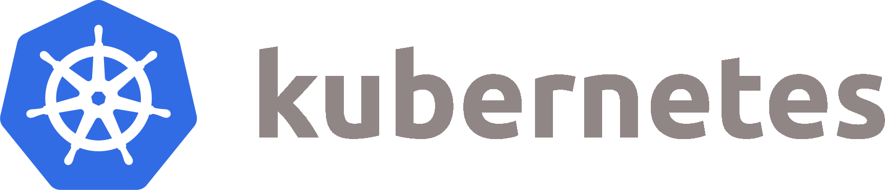
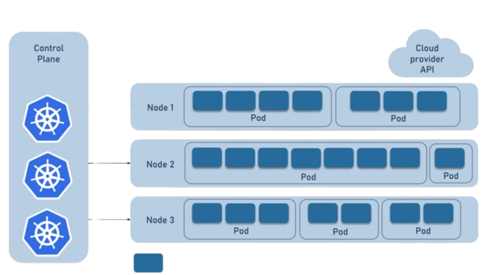
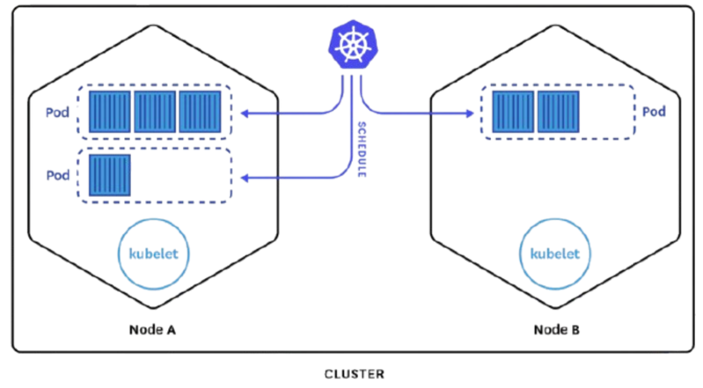

@import "Style/styles_epitech_stage.less"

# Kubernetes ? Qu'est-ce que c'est ?

<p></p>

## Ça sert à quoi ?
Kubernetes est une plateforme open-source qui permet d’orchestrer, déployer et gérer des applications conteneurisées à grande échelle via des pods.
En d’autres termes, il s’occupe d’automatiser le déploiement, la mise à jour, la mise à l’échelle et la résilience de tes conteneurs sans avoir à tout gérer manuellement sur chaque machine.

<p></p>

## C'est quoi un conteneur ?
Les conteneurs sont des environnements isolés qui contiennent tout ce dont une application a besoin pour fonctionner, y compris le code, les bibliothèques, et les dépendances qui sont déployés à partir d'images docker. Au final les conteneurs sont des sortes de boites dans lesquelles on va venir ranger nos applications. Ce qui permet une portabilité sans pareille, nous pouvons déplacer notre application d'une machine à une autre tant que celle-ci à docker d'installé.

[](https://connaissances.symexo.com/uploads/images/gallery/2024-09/image-1725270097181.png)

## C'est quoi un pod ?
Un Pod est comme une boîte dans laquelle Kubernetes place un ou plusieurs conteneurs qui travaillent ensemble.
L’intérêt du Pod, c’est qu’il assure que ces conteneurs partagent le même réseau et stockage, et qu’ils peuvent être déplacés ou répliqués facilement par Kubernetes.
En résumé: un Pod, c’est une petite unité que Kubernetes peut gérer pour que ton application fonctionne n’importe où, de manière fiable et portable.

<p></p>

<p class="info-note">Les exmples suivants seront exécutés sur un environnement Linux Debian 12 en utilisant le dépot <b>apt</b></p></div>

# Installation
<p class="info-note">Si vous n'êtes pas root sur votre système, vous devrez précéder la plupart des commandes par "<b>sudo</b>" pour vous octroyer les droits.</p>

Installer MicroK8s (Kubernetes léger)

MicroK8s est une distribution légère de Kubernetes, facile à installer pour tester ou développer localement.

## 1) Installer MicroK8s via Snap
### Mettre à jour les dépôts
``` bash
sudo apt update
sudo apt install snapd -y
```

### Installer la dernière version stable de MicroK8s
``` bash
sudo snap install microk8s --classic
```

## 2) Ajouter votre utilisateur au groupe microk8s
### Permet d'utiliser MicroK8s sans sudo
``` bash
sudo usermod -a -G microk8s $USER
sudo chown -f -R $USER ~/.kube
```

### Appliquer les changements de groupe immédiatement
``` bash
newgrp microk8s
```

## 3) Vérification de l'installation
### Vérifier que MicroK8s est prêt
``` bash
microk8s status --wait-ready
```

### Lancer un pod de test
``` bash
microk8s kubectl run hello-world --image=k8s.gcr.io/echoserver:1.4 --port=8080
```

### Vérifier que le pod fonctionne
``` bash
microk8s kubectl get pods
```


Cette commande va créer un pod de test qui exécute un serveur simple. Quand le pod est en état Running, votre installation est opérationnelle.

Vous devriez voir quelque chose comme ça :


<p class="success-note">Vous avez installé MicroK8s et Kubernetes fonctionne !</p>

# Mise à jour de MicroK8s

Pour mettre à jour MicroK8s et ses composants :

``` bash
sudo snap refresh microk8s
```

# Désinstallation

Supprimer MicroK8s et tous ses composants :

``` bash
sudo snap remove microk8s
sudo rm -rf ~/.kube
```


Tous vos pods, services, et configurations locales du cluster seront supprimés automatiquement.

<p class="success-note">Vous avez supprimé MicroK8s et toutes ses configurations !</p>